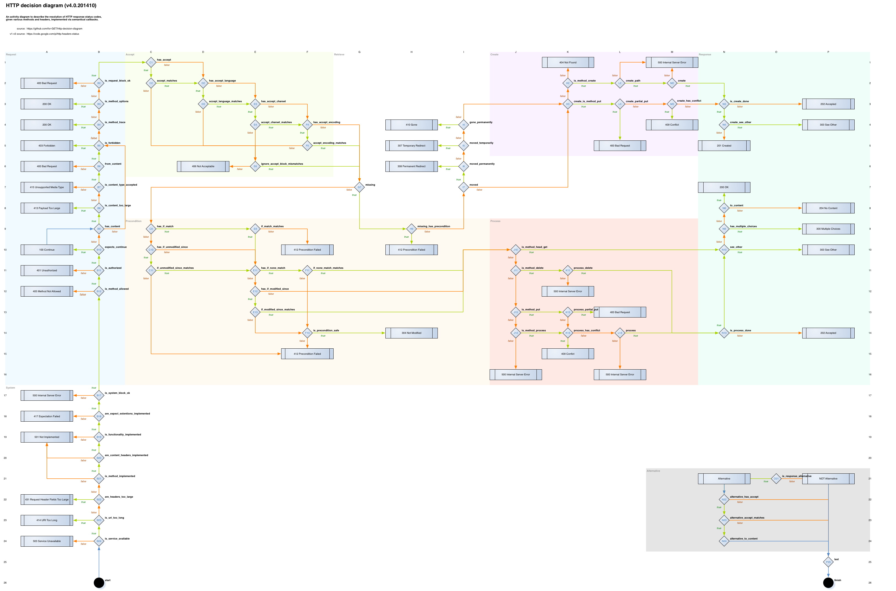

+++
title = "HTTP Status Codes are Meaningless"
date = 2020-09-10T13:06:58+00:00
+++

This decision diagram may be useful, but the fact that it is required at all is
ridiculous.

Instead, we should just use the generic `x00` status codes for all responses.

> Note: I am talking about "RESTful" APIs here. Most of this does not apply to
> regular websites serving browser traffic.

## For successes (2xx)
There is no real difference, from an API consumer's perspective, between a `200
OK` and a `202 Accepted`. The client knows which endpoint it is calling; it
knows that this particular endpoint handles requests asynchronously. The same
applies to the `201 Created` status code.

`204 No Content` is a bit different, as in this response is not allowed to
contain a response body, according to the [HTTP/1.1 spec][204-spec]. The
problem is that some web frameworks allow sending a body with this status code,
leading to problems when the response is processed by some component that does
not expect a response body. We can avoid this problem entirely by sending a
`200 OK` response with `Content-Length: 0` when sending a response with no
payload.

[204-spec]: https://tools.ietf.org/html/rfc7231#section-6.3.5

## For client failures (4xx)
In most cases, the status code, by itself, is not enough to understand what
caused the error. A `405 Method Not Allowed` needs to specify which methods are
allowed, `413 Payload Too Large` still needs to include an acceptable size to be
useful.

However, if we are going to send good error messages anyway, the status code
provides no real value. A well-written API consumer would ignore the specific
status code and instead parse the response body to determine which error
occurred, and why.

Furthermore, providing a status code may encourage clients to create half-baked
solutions that try to guess what caused the error by only looking at the status
code, instead of properly reading the response body.

All in all, for most client errors, we should return a generic `400 Bad
Request`, along with a descriptive error message (and, if possible, a
documented, unique string that allows programmatic processing of said error).

## For server failures (5xx)
For server-side errors, the API consumer cannot do much. In fact, providing
additional information to the client may be a security concern, as it reveals
server-side implementation details to potential attackers.

For most server-side errors, a `500 Internal Server Error` is all a client needs
to know, along with a request ID such that it can be sent to the API developers
to aid in debugging whatever caused the error.

## Conclusion
It really is that simple, an API only ever needs to return three error codes:
`200 OK`, `400 Bad Request`, and `500 Internal Server Error`. We [do][so1] [not][so2] [need][so3] [to][so4]
[fuss][so5] [about][so6] which status code to use.

[so1]: https://stackoverflow.com/q/1959947
[so2]: https://stackoverflow.com/q/2342579
[so3]: https://stackoverflow.com/q/3050518
[so4]: https://stackoverflow.com/q/3290182
[so5]: https://stackoverflow.com/q/3825990
[so6]: https://stackoverflow.com/q/16133923
